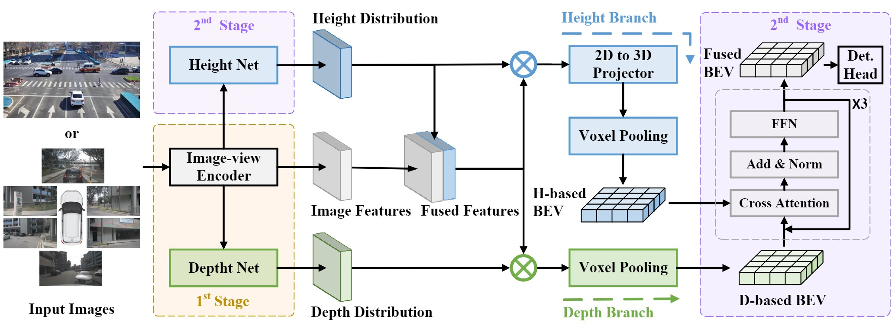

<p align="center">

  <h1 align="center">BEVHeight++: Toward Robust Visual Centric 3D Object Detection</h1>
  <p align="center">
    <a href="https://scholar.google.com/citations?user=EUnI2nMAAAAJ&hl=zh-CN"><strong>Lei Yang</strong></a>
    · 
    <a href="https://scholar.google.com.hk/citations?user=1ltylFwAAAAJ&hl=zh-CN&oi=sra"><strong>Tao Tang</strong></a>
    ·
    <a href="https://www.tsinghua.edu.cn/"><strong>Jun Li</strong></a>
    ·
    <a href="https://scholar.google.com.hk/citations?user=aMnHLz4AAAAJ&hl=zh-CN&oi=ao"><strong>Kun Yuan</strong></a>
    ·
    <a href="https://damo.alibaba.com/labs/intelligent-transportation"><strong>Peng Chen</strong></a>
    ·
    <a href="https://scholar.google.com.hk/citations?user=kLTnwAsAAAAJ&hl=zh-CN&oi=sra"><strong>Li Wang</strong></a>
    ·
    <a href="https://www.tsinghua.edu.cn/"><strong>Yi Huang</strong></a>
    ·
    <a href="https://scholar.google.com.hk/citations?user=KId65yQAAAAJ&hl=zh-CN&oi=ao"><strong>Lei Li</strong></a>
    ·
    <a href="https://scholar.google.com.hk/citations?user=0Q7pN4cAAAAJ&hl=zh-CN&oi=sra"><strong>Xinyu Zhang</strong></a>
    ·
    <a href="https://scholar.google.com.hk/citations?user=Jtmq_m0AAAAJ&hl=zh-CN&oi=sra"><strong>Kaicheng Yu</strong></a>
  </p>


<h2 align="center"></h2>
  <div align="center">
    
  </div>

<p align="center">
  <br>
    <a href="https://pytorch.org/get-started/locally/"></a>
    <a href="https://pytorchlightning.ai/"></a>
     <a href='https://hub.docker.com/repository/docker/yanglei2024/op-bevheight/general'></a>
    <br></br>
    </a>
  </p>
</p>

**BEVHeight++** is a new vision-based 3D object detector specially designed for both roadside and vihicle-side scenarios. On popular 3D detection benchmarks of roadside cameras, BEVHeight++ surpasses all previous vision-centric methods by a significant margin. In terms of the ego-vehicle scenario, our BEVHeight++ also possesses superior over depth-only methods.

# News

- [2024/09/06] Both arXiv and codebase are released!
# Incoming

- [ ] Release the pretrained models

<br>

<!-- TABLE OF CONTENTS -->
<details open="open" style='padding: 10px; border-radius:5px 30px 30px 5px; border-style: solid; border-width: 1px;'>
  <summary>Table of Contents</summary>
  <ol>
    <li>
      <a href="#Getting Started">Getting Started</a>
    </li>
    <li>
      <a href="#Acknowledgment">Acknowledgment</a>
    </li>
    <li>
      <a href="#Citation">Citation</a>
    </li>
  </ol>
</details>

<br/>

# Getting Started

- [Installation](docs/install.md)
- [Prepare Dataset](docs/prepare_dataset.md)

Train `BEVDepth / BEVHeight / BEVHeight++` with 8 GPUs
```
python [EXP_PATH] --amp_backend native -b 8 --gpus 8
```
Eval `BEVDepth / BEVHeight / BEVHeight++` with 8 GPUs
```
python [EXP_PATH] --ckpt_path [CKPT_PATH] -e -b 8 --gpus 8
```
**For more specific training and evaluation commands, please refer to the `train_scripts` directory.**

# Experimental Results
- **DAIR-V2X-I Dataset**


- **Rope3D Dataset**


- **KITTI Dataset**
<div align=left>
<table>
     <tr align=center>
        <td rowspan="3">Method</td> 
        <td colspan="3" align=center>AP|3D</td>
        <td colspan="3" align=center>AP|BEV</td>
        <td rowspan="3" align=center>config</td> 
        <td rowspan="3" align=center>model ckpt</td>
    </tr>
    <tr align=center>
    </tr>
    <tr align=center>
        <td>Easy</td>
        <td>Mod.</td>
        <td>Hard</td>
        <td>Easy</td>
        <td>Mod.</td>
        <td>Hard</td>
    </tr>
    <tr align=center>
        <td>BEVDepth</td> 
        <td>10.69</td> 
        <td>7.31</td> 
        <td>5.88</td> 
        <td>35.14</td> 
        <td>23.22</td> 
        <td>19.33</td>
        <td><a href=exps/kitti-360/bev_depth_lss_r101_384_1280_256x256.py>config</td>
        <td>\</td>
    </tr>
    <tr align=center>
        <td>BEVHeight</td> 
        <td>10.61</td> 
        <td>6.97</td> 
        <td>5.51</td> 
        <td>34.58</td> 
        <td>22.05</td> 
        <td>17.96</td>
        <td><a href=exps/kitti-360/bev_height_lss_r101_384_1280_256x256.py>config</td>
        <td>\</td>
    </tr>
    <tr align=center>
        <td>BEVHeight++</td> 
        <td><b>11.37</b></td> 
        <td><b>8.06</b></td> 
        <td><b>6.35</b></td> 
        <td><b>36.81</b></td> 
        <td><b>25.49</b></td> 
        <td><b>20.81</b></td>
        <td><a href=exps/kitti-360/bev_height_plus_lss_r101_384_1280_256x256.py>config</td>
        <td><a href="https://cloud.tsinghua.edu.cn/f/ebd15a0b604548dcb681/?dl=1">model_ckpt</td>  
    </tr>
    
<table>
</div>

- **KITTI-360 Dataset**
<div align=left>
<table>
     <tr align=center>
        <td rowspan="3">Method</td> 
        <td colspan="3" align=center>AP3D (IoU=0.5)</td>
        <td colspan="3" align=center>AP3D (IoU=0.25)</td>
        <td rowspan="3" align=center>config</td> 
        <td rowspan="3" align=center>model ckpt</td>
    </tr>
    <tr align=center>
    </tr>
    <tr align=center>
        <td>AP (Lrg)</td>
        <td>AP (Car)</td>
        <td>mAP</td>
        <td>AP (Lrg)</td>
        <td>AP (Car)</td>
        <td>mAP</td>
    </tr>
    <tr align=center>
        <td>BEVDepth</td> 
        <td>2.17</td>
        <td>42.01</td> 
        <td>22.09</td> 
        <td>30.52</td> 
        <td>59.84</td> 
        <td>45.18</td>
        <td><a href=exps/kitti-360/bev_depth_lss_r101_384_1280_256x256.py>config</td>
        <td><a href="https://cloud.tsinghua.edu.cn/f/ae5a4d38a0c34e6c9d37/?dl=1">model_ckpt</td>
    </tr>
    <tr align=center>
        <td>BEVHeight</td> 
        <td>1.78</td> 
        <td>41.76</td> 
        <td>21.77</td> 
        <td>33.02</td> 
        <td>56.69</td> 
        <td>44.85</td>
        <td><a href=exps/kitti-360/bev_height_lss_r101_384_1280_256x256.py>config</td>
        <td><a href="https://cloud.tsinghua.edu.cn/f/4e75b226de404716a11f/?dl=1">model_ckpt</td>
    </tr>
    <tr align=center>
        <td>BEVHeight++</td> 
        <td><b>2.35</b></td> 
        <td><b>46.84</b></td> 
        <td><b>24.59</b></td> 
        <td><b>30.72</b></td> 
        <td><b>65.78</b></td> 
        <td><b>48.25</b></td>
        <td><a href=exps/kitti-360/bev_height_plus_lss_r101_384_1280_256x256.py>config</td>
        <td><a href="https://cloud.tsinghua.edu.cn/f/f407ebaedb794195aa36/?dl=1">model_ckpt</td>
    </tr>
    
<table>
</div>

- **Waymo Dataset**
>* BEVDepth: <a href=exps/waymo/bev_depth_lss_r101_864_1536_256x256.py>config</a>,   <a href="https://cloud.tsinghua.edu.cn/f/5fa168024899492d835a/?dl=1">model_ckpt</a>
> * BEVHeight: <a href=exps/waymo/bev_height_lss_r101_864_1536_256x256.py>config</a>,   <a href="https://cloud.tsinghua.edu.cn/f/5fa5fae419ed43959622/?dl=1">model_ckpt</a>
>* BEVHeight++: <a href=exps/waymo/bev_height_plus_lss_r101_864_1536_256x256.py>config</a>,   <a href="https://cloud.tsinghua.edu.cn/f/f4be449a6fe04aa6806a/?dl=1">model_ckpt</a>

<div align=left>
<table>
     <tr align=center>
        <td rowspan="3">IoU3D</td> 
        <td rowspan="3">Difficulty</td> 
        <td rowspan="3">Method</td> 
        <td colspan="4" align=center>AP3D</td>
        <td colspan="4" align=center>APH3D</td>
    </tr>
    <tr align=center>
    </tr>
    <tr align=center>
        <td>All</td>
        <td>0-30</td>
        <td>30-50</td>
        <td>50- $\infty$ </td>
        <td>All</td>
        <td>0-30</td>
        <td>30-50</td>
        <td>50- $\infty$	</td>
    </tr>
    <tr align=center>
        <td rowspan="3">0.7</td> 
        <td rowspan="3">Level_1</td> 
        <td>BEVDepth</td>
        <td>2.86</td>
        <td>7.51</td>
        <td>1.13</td>
        <td>0.12</td>
        <td>2.84</td>
        <td>7.45</td>
        <td>1.11</td>
        <td>0.12</td>
    </tr>
    <tr align=center>
        <td>BEVHeight</td>
        <td>2.62</td>
        <td>6.78</td>
        <td>1.35</td>
        <td>0.08</td>
        <td>2.60</td>
        <td>6.71</td>
        <td>1.33</td>
        <td>0.08</td>
    </tr>
    <tr align=center>
        <td>BEVHeight++</td>
        <td><b>3.10</b></td>	
        <td><b>8.04</b></td>	
        <td><b>1.41</b></td>	
        <td><b>0.13</b></td>	
        <td><b>3.07</b></td>	
        <td><b>7.96</b></td>	
        <td><b>1.40</b></td>	
        <td><b>0.13</b></td>
    </tr>
    <tr align=center>
        <td rowspan="3">0.7</td> 
        <td rowspan="3">Level_2</td> 
        <td>BEVDepth</td>
        <td>2.68</td>	
        <td>7.50</td>	
        <td>1.09</td>	
        <td>0.10</td>	
        <td>2.66</td>	
        <td>7.43</td>	
        <td>1.08</td>	
        <td>0.10</td>
    </tr>
    <tr align=center>
        <td>BEVHeight</td>
        <td>2.46</td>	
        <td>6.77</td>	
        <td>1.30</td>	
        <td>0.07</td>	
        <td>2.44</td>	
        <td>6.70</td>	
        <td>1.29</td>	
        <td>0.07</td>
    </tr>
    <tr align=center>
        <td>BEVHeight++</td>
        <td><b>2.91</b></td>	
        <td><b>8.03</b></td>	
        <td><b>1.36</b></td>	
        <td><b>0.12</b></td>	
        <td><b>2.88</b></td>	
        <td><b>7.95</b></b></td>	
        <td><b>1.35</b></td>	
        <td><b>0.11</b></td>
    </tr>
    <tr align=center>
        <td rowspan="3">0.5</td> 
        <td rowspan="3">Level_1</td> 
        <td>BEVDepth</td>
        <td>13.22</td>	
        <td>31.67</td>	
        <td>6.01</td>	
        <td>1.43</td>	
        <td>13.05</td>	
        <td>31.27</td>	
        <td>5.93</td>	
        <td>1.41</td>
    </tr>
    <tr align=center>
        <td>BEVHeight</td>
        <td>12.73</td>	
        <td>29.87</td>	
        <td>5.90</td>	
        <td>1.33</td>	
        <td>12.55</td>	
        <td>29.45</td>	
        <td>5.83</td>	
        <td>1.30</td>
    </tr>
    <tr align=center>
        <td>BEVHeight++</td>
        <td><b>14.00</b></td>	
        <td><b>32.59</b></td>	
        <td><b>6.31</b></td>	
        <td><b>1.86</b></td>	
        <td><b>13.81</b></td>	
        <td><b>32.16</b></td>	
        <td><b>6.25</b></td>	
        <td><b>1.83</b></td>
    </tr>
    <tr align=center>
        <td rowspan="3">0.5</td> 
        <td rowspan="3">Level_2</td> 
        <td>BEVDepth</td>
        <td>12.41</td>	
        <td>31.61</td>	
        <td>5.81</td>	
        <td>1.25</td>	
        <td>12.25</td>	
        <td>31.21</td>	
        <td>5.73</td>	
        <td>1.23</td>
    </tr>
    <tr align=center>
        <td>BEVHeight</td>
        <td>11.95</td>	
        <td>29.81</td>	
        <td>5.70</td>	
        <td>1.16</td>	
        <td>11.78</td>	
        <td>29.40</td>	
        <td>5.63</td>	
        <td>1.14</td>
    </tr>
    <tr align=center>
        <td>BEVHeight++</td>
        <td><b>13.14</b></td>	
        <td><b>32.53</b></td>	
        <td><b>6.10</b></td>	
        <td><b>1.62</b></td>	
        <td><b>12.97</b></td>	
        <td><b>32.10</b></td>	
        <td><b>6.04</b></td>	
        <td><b>1.59</b></td>
    </tr> 
<table>
</div>

# Acknowledgment
This project is not possible without the following codebases.
* [BEVHeight](https://github.com/ADLab-AutoDrive/BEVHeight)
* [BEVDepth](https://github.com/Megvii-BaseDetection/BEVDepth)
* [DAIR-V2X](https://github.com/AIR-THU/DAIR-V2X)
* [pypcd](https://github.com/dimatura/pypcd)

# Citation
If you use BEVHeight in your research, please cite our work by using the following BibTeX entry:
```
@article{yang2023bevheight++,
  title={Bevheight++: Toward robust visual centric 3d object detection},
  author={Yang, Lei and Tang, Tao and Li, Jun and Chen, Peng and Yuan, Kun and Wang, Li and Huang, Yi and Zhang, Xinyu and Yu, Kaicheng},
  journal={arXiv preprint arXiv:2309.16179},
  year={2023}
}
```
